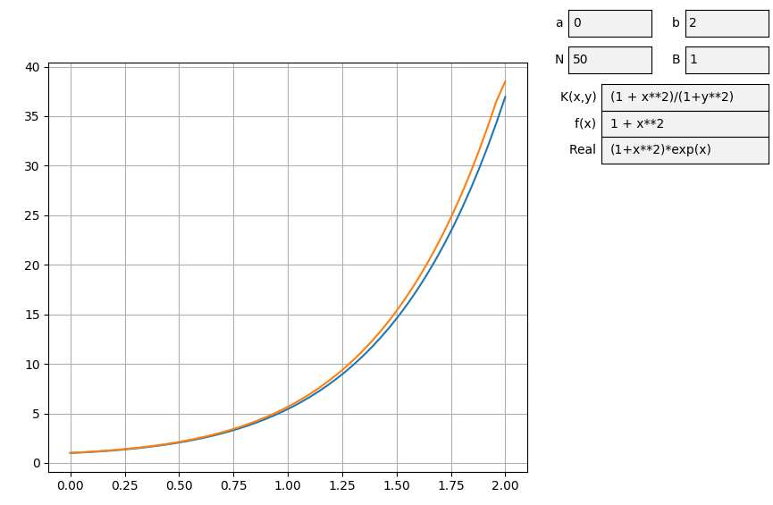

# Численное решение интегральных уравнений Вольтерра 2-го рода

Интегральным называют уравнение, в котором неизвестная функция $U(x)$ стоит под знаком интегралла.

## Уравнение Фредгольма второго 2-го рода имеет вид:

$$U(x) - \beta\int^b_aK(x,y)U(y)dy = f(x)$$

где ядро $K(x,y)$ и $f(x)$ заданные функции определенные на квадрате $a \leq x \leq b$, $a \leq y \leq b$. Если ядро отлично от нуля только на треугольнике $a \leq y \leq x \leq b$ (т.е. $K(x,y) = 0 $ при $x < y$), то уравнение переходит в уравнение Вольтерра второго рода.

## Уравнение Вольтерра 2-го рода имеет вид:

$$U(x) - \beta\int^x_aK(x,y)U(y)dy = f(x)$$

Переменная $\beta$ и функции $K(x,y)$ и $f(x)$ изначально определены.

# Метод замены интегралла квадратурной суммой

Возьмем на $[a,b]$ какую-нибудь квадратную формулу с узлами $x_n$ и весами $w_n$:

$$\int^a_bg(y)dy \approx \sum^M_{m=1}w_mg(x_m)$$

Введем в квадрате $a \leq x \leq b, a \leq y \leq b$ сетку $x_n,y_m$, где x_n и y_m являются узлами формулы. Заменяя интеграл в уравнении суммой, получим систему

$$v_n - \beta\sum^M_{m=1}w_mK_{nm}v_m = f_n \qquad\qquad 1 \leq n \leq N$$ 

Так как задаю одиковое количество элементов сетки по $x$ и $y$, то есть $M=N$, и при $x < y$ $K(x,y) = 0$, то можно примести систему к виду:

$$v_n - \beta\sum^n_{m=1}w_mK_{nm}v_m = f_n \qquad\qquad 1 \leq n \leq N$$ 

Мы получаем систему линейных уравнений $Bv = f$, где $В = E - \beta C$, $C = \{ c_{nm}\} = \{ w_mK_{nm} \}$, $f = \{f_n= f(x_n)\}$, которые можно решить уже изместными методами (в моем случае методом Гауса). 